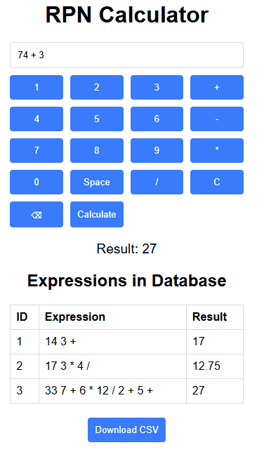

  

# RPN Calculator Application

  

The RPN (Reverse Polish Notation) Calculator app allows users to perform calculations using the RPN method, view their calculation history, and download their calculations as a CSV file.




  

## Table of Contents

  

1. [Introduction](#introduction)

2. [Project Structure](#project-structure)

3. [Prerequisites](#prerequisites)

4. [Installation](#installation)

5. [Usage](#usage)

6. [API Endpoints](#api-endpoints)

7. [Running Tests](#running-tests)

8. [License](#license)

  

## Introduction

  

This application includes a backend built with FastAPI, PostgreSQL,a frontend built with HTML, CSS, and JavaScript, and uses Docker for containerization. The backend includes an API to perform RPN calculations, retrieve calculation history, and export data as CSV.

  

## Project Structure

  

```

rpn_calculator/

├── app/

│ ├── __init__.py

│ ├── rpn_calculator.py

│ ├── api.py

├── db/

│ ├── init.sql

├── tests/

│ ├── test_rpn_calculator.py

│ ├── test_api.py

├── web_app/

│ ├── index.html

│ ├── styles.css

│ ├── script.js

│ ├── Dockerfile

│ ├── nginx.conf

├── requirements.txt

├── Dockerfile

├── docker-compose.yml

├── .env

```

  

## Prerequisites

  

- Docker

- Docker Compose

  

## Installation

  

1.  **Clone the repository:**

```sh

git clone https://github.com/yourusername/rpn-calculator.git

cd rpn_calculator

```

  

2.  **Create a `.env` file in the project root directory with the following content:**

```env

DATABASE_URL=postgresql://user:password@db/dbname

POSTGRES_USER=user

POSTGRES_PASSWORD=password

POSTGRES_DB=dbname

```

  

3.  **Build and run the Docker containers:**

```sh

docker-compose up --build

```

  

## Usage

  

1.  **Access the web application:**

Open your browser and go to `http://localhost:8080`.

  

2.  **Using the application:**

- Enter an RPN expression in the input field and press "Calculate" to see the result.

- View the calculation history in the table below the calculator.

- Click "Download CSV" to export the calculation history as a CSV file.

  

## API Endpoints

  

-  **Calculate RPN Expression**

```http

POST /calculate/

```

-  **Request Body:**

```json

{

"expression": "3 4 +"

}

```

-  **Response:**

```json

{

"expression": "3 4 +",

"result": 7

}

```

  

-  **Export Calculations as CSV**

```http

GET /export_csv/

```

-  **Response:** CSV file containing all calculations

  

-  **Get Calculation History**

```http

GET /expressions/

```

-  **Response:**

```json

[

{

"id": 1,

"expression": "3 4 +",

"result": 7

},

...

]

```

  

## Running Tests

  

1.  **Access the Docker container for the API:**

```sh

docker exec -it rpn-calculator-img-id /bin/sh

```

  

2.  **Run unit tests:**

```sh

python -m unittest discover -s tests

```

  

